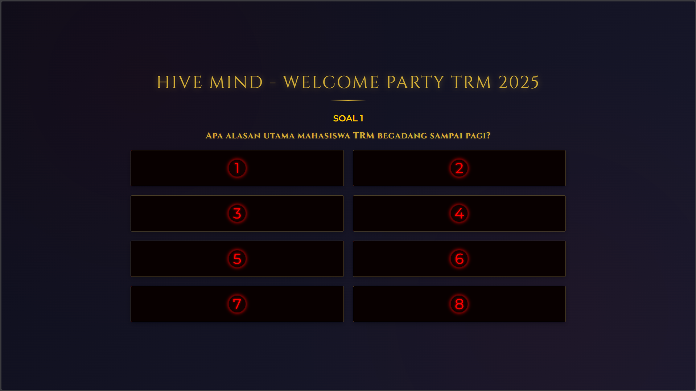

# Hive Mind - Welcome Party TRM 2025

An interactive game application inspired by Stranger Things, designed for the TRM 2025 Welcome Party. This application consists of two main interfaces: an admin panel for controlling the game and a board display for showing the game to participants.



## Project Overview

This project is a web-based interactive game that simulates a quiz show similar to Family Feud. It features a Stranger Things-inspired theme with elegant styling and smooth animations. The application uses BroadcastChannel API for real-time communication between the admin panel and the board display within the same browser.

### Key Features

- **Dual Interface System**: Separate admin panel and board display
- **Real-time Communication**: Instant updates between interfaces using BroadcastChannel API
- **Round-based Gameplay**: 5 different rounds with customizable questions and answers
- **Interactive Controls**: Toggle answers, play sound effects, and reset game state
- **Persistent Storage**: Game data saved in browser's localStorage
- **Responsive Design**: Works on various screen sizes
- **Stranger Things Theme**: Elegant dark theme with gold accents and red highlights

## File Structure

```
├── admin.html          # Admin control panel interface
├── admin.js            # Admin panel functionality and logic
├── board.html          # Board display interface
├── board.js            # Board display functionality and logic
└── stranger-things.css # Shared styling for both interfaces
```

## Getting Started

### Prerequisites

- A modern web browser (Chrome, Firefox, Edge, Safari)
- Basic understanding of web technologies (HTML, CSS, JavaScript)

### Installation

1. Clone or download this repository
2. Open `admin.html` in your browser to access the admin panel
3. Open `board.html` in your browser to access the board display
4. (Optional) Open both interfaces in different browser windows/tabs for full functionality

### Usage

1. **Admin Panel**:
   - Select a round using the dropdown menu
   - Edit questions and answers in the editor section
   - Click "UPDATE KE LAYAR" to send data to the board
   - Use toggle buttons to reveal/hide answers on the board
   - Use "❌ SUARA SALAH" for wrong answer sound effect
   - Use "🔄 RESET GAME" to reset the board state

2. **Board Display**:
   - Automatically displays questions and answers from the admin panel
   - Shows visual effects when answers are revealed
   - Displays large "X" overlay for wrong answers
   - Plays sound effects for correct and wrong answers

## Documentation

For detailed information about the project, please refer to the following documentation files:

- [User Guide](USER_GUIDE.md) - Instructions for using the application
- [Admin Panel Documentation](ADMIN_PANEL.md) - Detailed information about the admin interface
- [Board Display Documentation](BOARD_DISPLAY.md) - Information about the board interface
- [CSS Styling Documentation](CSS_STYLING.md) - Details about the visual design and styling
- [Technical Documentation](TECHNICAL_DOCS.md) - Developer documentation for maintenance and extension

## Technical Details

### Architecture

The application uses a client-server-like pattern within the browser using BroadcastChannel API:

- **BroadcastChannel**: Enables communication between admin and board interfaces
- **localStorage**: Persists game data between sessions
- **Event-driven**: All interactions trigger specific events that update the UI

### Data Structure

The application uses a structured data format for questions and answers:

```javascript
[
  { text: "ANSWER TEXT", score: 35 },
  // ... up to 8 answers per round
]
```

### Browser Compatibility

- Modern browsers with BroadcastChannel API support
- Audio playback requires user interaction before automatic playback
- CSS features may require modern browser support

## Customization

### Adding New Rounds

To add new rounds, modify the `questions` array and `defaultRoundsData` array in `admin.js`:

1. Add a new question to the `questions` array
2. Add a new set of answers to the `defaultRoundsData` array
3. Update the round selector options in `admin.html` if needed

### Styling

All styling is contained in `stranger-things.css`:
- Theme colors are defined in CSS variables
- Fonts are imported from Google Fonts
- Responsive design uses CSS Grid and Flexbox

## Troubleshooting

### Audio Issues

- If sound effects don't play, click anywhere on the board display once to enable audio
- Browser autoplay policies may block audio without user interaction

### Communication Issues

- Ensure both admin and board interfaces are opened in the same browser
- BroadcastChannel API doesn't work across different browsers
- Refresh both interfaces if they become out of sync

### Data Persistence

- Game data is stored in browser's localStorage
- Clearing browser data will reset all saved information
- Data is specific to each browser and device

## Contributing

This project is designed specifically for the TRM 2025 Welcome Party. Contributions should focus on:
- Bug fixes
- Performance improvements
- Accessibility enhancements
- Browser compatibility fixes

## License

This project is intended for exclusive use at the TRM 2025 Welcome Party. All rights reserved.

## Acknowledgments

- Inspired by Stranger Things series aesthetics
- Sound effects from MyInstants.com
- Fonts from Google Fonts